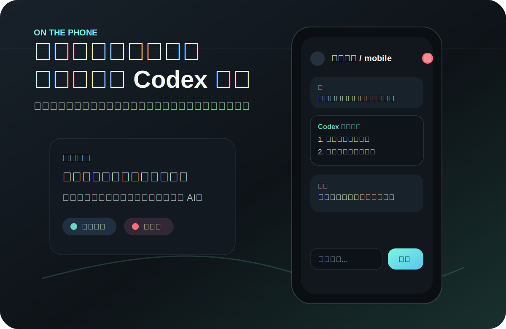
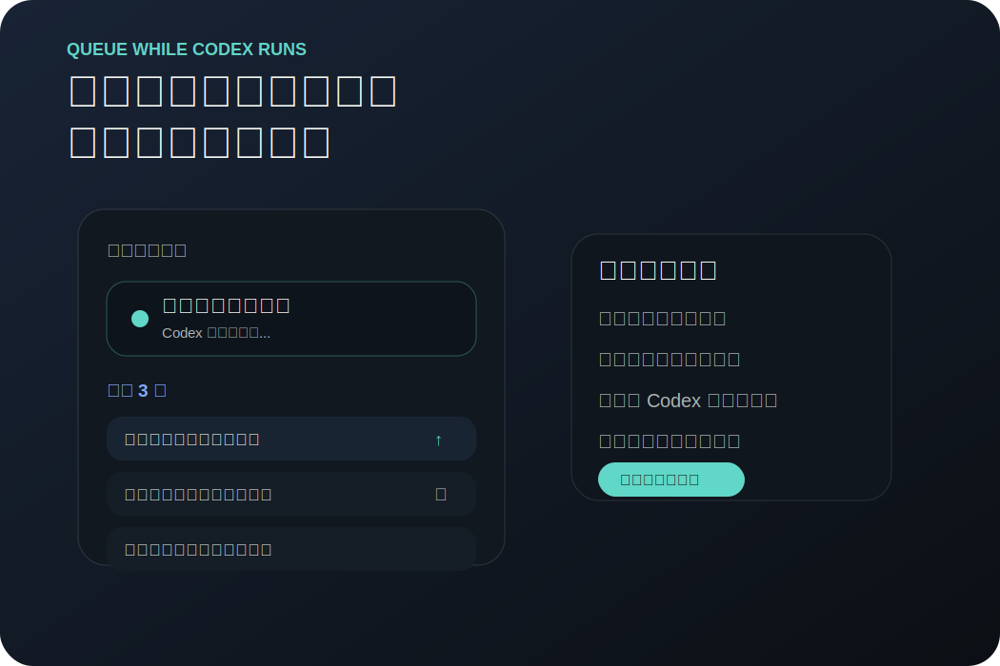
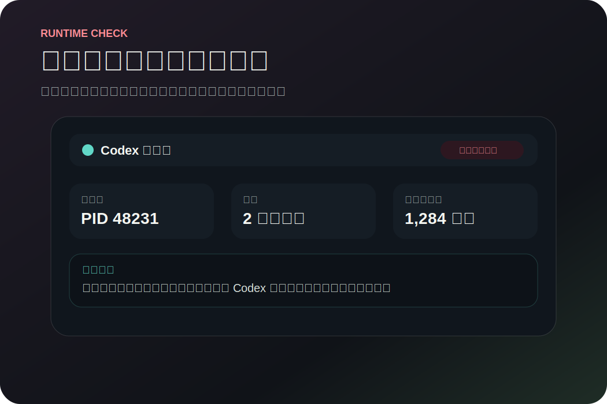
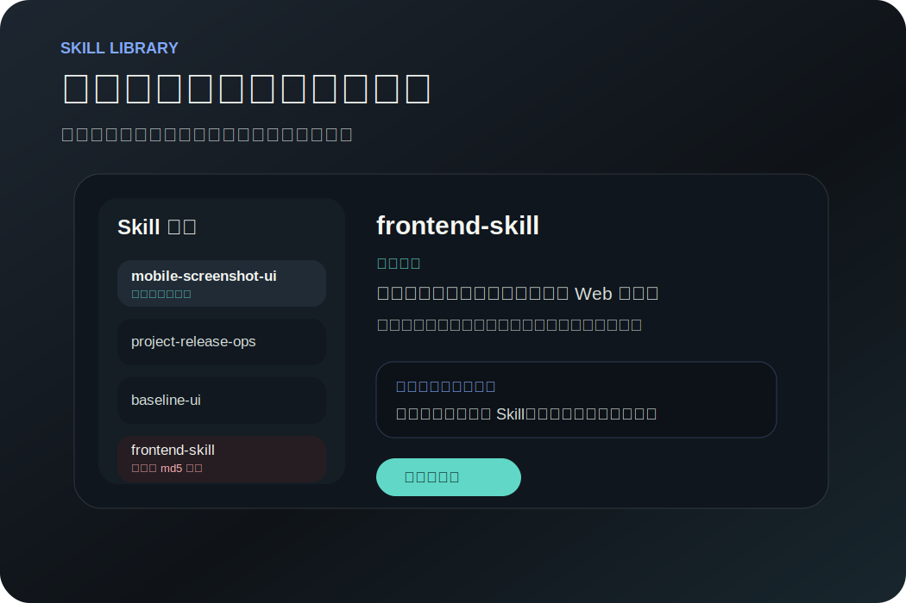
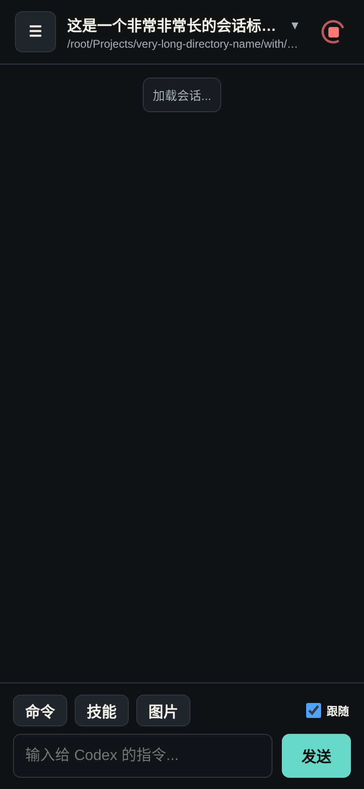
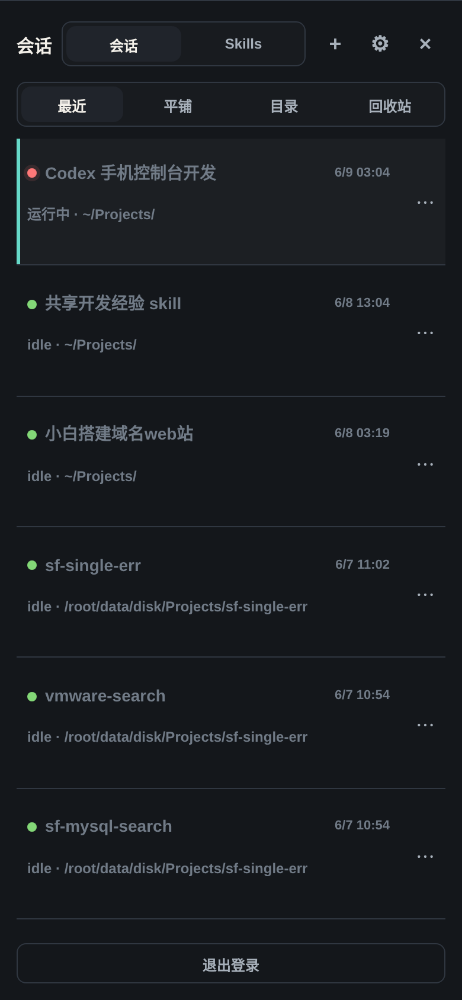

# Codex Mobile Console

Self-hosted mobile control panel for persistent Codex development sessions.

Codex Mobile Console lets you control Codex sessions from your phone while Codex keeps running on your own server, VPS, NAS, home lab, or remote development box.



## What It Is

This is not a generic AI chat UI and not a mobile SSH replacement. It is a private, mobile-first control surface for developers who already run Codex on a server and want to:

- check progress from a phone
- send follow-up prompts without reconnecting SSH
- switch between Codex sessions and projects
- queue the next instructions while a task is running
- stop stuck commands and inspect runtime state
- keep Codex work alive after the terminal or browser disconnects

SSH clients on phones are fine for emergency commands, but they are poor control panels for long-running AI development work. This project is designed around a different workflow:

- keep Codex sessions alive on the server
- open a mobile-friendly PWA when you need to check progress
- switch between projects and sessions quickly
- send follow-up prompts without restarting terminal sessions
- stop stuck runs and inspect runtime state from the browser

## Use Cases

| Remote control | Prompt queue | Runtime diagnostics |
| --- | --- | --- |
|  |  |  |

## Highlights

- Mobile-first web UI for Codex sessions
- Persistent server-side sessions; terminal disconnects do not stop Codex
- Recent, flat, directory-grouped, and trash session views
- Global Codex history discovery from `~/.codex/sessions`
- Saved Codex JSONL context rendering
- Message folding for tool output, code, and long messages
- Queue support for prompts sent while Codex is running
- Top-level run state indicator and stop control
- Runtime panel with Codex process, browser cache, and service status
- Image upload for multimodal prompts
- Skill manager backed by async local scanning
- PWA service worker cache for phone usage
- 30-day login cookie for trusted personal devices
- Safe restart flow that waits for active Codex child processes

## Feature Tour

| Skill management | Chat | Sessions |
| --- | --- | --- |
|  |  |  |

## Quick Start

Prerequisites:

- Linux server with Node.js 20+
- Codex CLI installed and authenticated on the server
- A project directory such as `$HOME/Projects`

One-command install on a Linux server:

```bash
curl -fsSL https://welcome.ai.hehao.pro/install.sh | bash
```

This installs the latest release bundle from the OSS release channel, stores the app under `/opt/codex-mobile-console`, creates a systemd service, starts it on `127.0.0.1:7072`, configures the OSS update source, and prints the generated admin password.

The service runs as the user who executed the installer, so Codex should already be authenticated for that user.

Optional domain and HTTPS setup:

```bash
curl -fsSL https://welcome.ai.hehao.pro/install.sh | DOMAIN=codex.example.com SETUP_CADDY=1 bash
```

Point the domain A record to the server first. With `DOMAIN` set, the installer installs/enables Caddy when needed and writes a reverse proxy from `https://codex.example.com` to `127.0.0.1:7072`.

Optional bare public-IP setup:

```bash
curl -fsSL https://welcome.ai.hehao.pro/install.sh | PUBLIC_BIND=1 bash
```

This binds the app directly to `0.0.0.0:7072`. Use firewall/security group rules if you choose this mode.

Clone and run:

```bash
git clone https://github.com/twotwo7/codex-mobile-console.git
cd codex-mobile-console
npm install
COOKIE_SECURE=0 npm start
```

The server listens on `127.0.0.1:7072` by default.

On first start, an admin password is generated at:

```bash
cat data/admin-password.txt
```

For production-style local service setup:

```bash
sudo ./scripts/install-systemd.sh
sudo systemctl enable --now codex-mobile-console
```

Then put it behind HTTPS before exposing it to the internet. See [Deployment](docs/deployment.md).

## Configuration

Environment variables:

| Variable | Default | Purpose |
| --- | --- | --- |
| `HOST` | `127.0.0.1` | Bind host |
| `PORT` | `7072` | Bind port |
| `DATA_DIR` | `./data` | State, password, uploads, registry data |
| `CODEX_HOME` | `/root/.codex` | Codex home directory |
| `CODEX_BIN` | `/usr/bin/codex` | Codex executable |
| `CODEX_NODE` | current Node executable | Node runtime when `CODEX_BIN` is a `.js` file |
| `PROJECTS_ROOT` | `/root/Projects` | Default project browser root |
| `SKILL_ROOTS` | `$CODEX_HOME/skills,/root/.agents/skills` | Skill scan roots |
| `APP_UPDATE_MANIFEST_URL` | unset | Preferred update manifest URL, such as an Aliyun OSS `latest.json` |
| `COOKIE_SECURE=0` | unset | Disable Secure cookies for non-HTTPS local testing |

## Aliyun OSS Install And Update Source

The recommended public installer uses the OSS release channel:

```bash
curl -fsSL https://welcome.ai.hehao.pro/install.sh | bash
```

New installs are configured with the OSS update manifest, so app update checks use OSS by default. Users can disable automatic updates in the console settings.

GitHub stays as the upstream repository while production servers can check a domestic OSS release manifest first.

Publish a release bundle:

```bash
ALI_OSS_ACCESS_KEY_ID=... \
ALI_OSS_ACCESS_KEY_SECRET=... \
ALI_OSS_BUCKET=your-bucket \
ALI_OSS_ENDPOINT=oss-cn-hangzhou.aliyuncs.com \
ALI_OSS_PREFIX=codex-mobile-console/releases \
ALI_OSS_PUBLIC_BASE_URL=https://your-bucket.oss-cn-hangzhou.aliyuncs.com \
npm run release:oss
```

Configure deployed services to prefer the OSS manifest:

```bash
APP_UPDATE_MANIFEST_URL=https://your-bucket.oss-cn-hangzhou.aliyuncs.com/codex-mobile-console/releases/latest.json
```

The updater downloads a Git bundle from OSS, verifies sha256, fetches the release tag locally, then checks out that tag. GitHub remains the fallback source when no manifest URL is configured.

## Security Model

This app can start Codex processes and optionally run them with elevated permissions. Treat it as a private server control surface.

Recommended:

- expose only through HTTPS
- use a strong admin password
- keep it behind your own trusted domain, VPN, or access gateway
- do not commit `data/`, `runtime/`, `.env`, or token files
- do not expose it as a public demo with real server access

The login cookie lasts 30 days so your own phone does not need frequent logins.

## Documentation

- [Deployment](docs/deployment.md)
- [Promotion plan](docs/promotion.md)
- [Roadmap](docs/roadmap.md)
- [Contributing](CONTRIBUTING.md)

## Project Status

This is a personal self-hosted tool that has reached a usable v1.x shape. The core chat/session workflow is the priority. The project intentionally favors reliability and mobile usability over complex frontend automation.

## License

MIT
