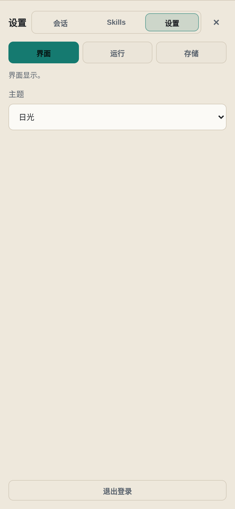

# Codex Mobile Console

Self-hosted mobile control panel for persistent Codex development sessions.

Codex Mobile Console is for developers who run Codex on a server, VPS, NAS, or home lab and want to continue those sessions from a phone without living inside a mobile SSH client. The browser is just the control surface; Codex keeps running on the server.


## Why This Exists

SSH clients on phones are fine for emergency commands, but they are poor control panels for long-running AI development work. This project is designed around a different workflow:

- keep Codex sessions alive on the server
- open a mobile-friendly PWA when you need to check progress
- switch between projects and sessions quickly
- send follow-up prompts without restarting terminal sessions
- stop stuck runs and inspect runtime state from the browser

## Highlights

- Mobile-first web UI for Codex sessions
- Persistent server-side sessions; terminal disconnects do not stop Codex
- Recent, flat, directory-grouped, and trash session views
- Global Codex history discovery from `~/.codex/sessions`
- Saved Codex JSONL context rendering
- Message folding for tool output, code, and long messages
- Queue support for prompts sent while Codex is running
- Top-level run state indicator and stop control
- Runtime panel with Codex process, browser cache, and service status
- Image upload for multimodal prompts
- Skill manager backed by async local scanning
- PWA service worker cache for phone usage
- 30-day login cookie for trusted personal devices
- Safe restart flow that waits for active Codex child processes

## Screenshots

| Chat | Sessions | Settings |
| --- | --- | --- |
|  |  |  |

## Quick Start

Prerequisites:

- Linux server with Node.js 20+
- Codex CLI installed and authenticated on the server
- A project directory such as `$HOME/Projects`

One-command install on a Linux server:

```bash
curl -fsSL https://raw.githubusercontent.com/twotwo7/codex-mobile-console/main/scripts/install.sh | bash
```

This installs the app under `/opt/codex-mobile-console`, creates a systemd service, starts it on `127.0.0.1:7072`, and prints the generated admin password.

The service runs as the user who executed the installer, so Codex should already be authenticated for that user.

Clone and run:

```bash
git clone https://github.com/twotwo7/codex-mobile-console.git
cd codex-mobile-console
npm install
COOKIE_SECURE=0 npm start
```

The server listens on `127.0.0.1:7072` by default.

On first start, an admin password is generated at:

```bash
cat data/admin-password.txt
```

For production-style local service setup:

```bash
sudo ./scripts/install-systemd.sh
sudo systemctl enable --now codex-mobile-console
```

Then put it behind HTTPS before exposing it to the internet. See [Deployment](docs/deployment.md).

## Configuration

Environment variables:

| Variable | Default | Purpose |
| --- | --- | --- |
| `HOST` | `127.0.0.1` | Bind host |
| `PORT` | `7072` | Bind port |
| `DATA_DIR` | `./data` | State, password, uploads, registry data |
| `CODEX_HOME` | `/root/.codex` | Codex home directory |
| `CODEX_BIN` | `/usr/bin/codex` | Codex executable |
| `CODEX_NODE` | current Node executable | Node runtime when `CODEX_BIN` is a `.js` file |
| `PROJECTS_ROOT` | `/root/Projects` | Default project browser root |
| `SKILL_ROOTS` | `$CODEX_HOME/skills,/root/.agents/skills` | Skill scan roots |
| `COOKIE_SECURE=0` | unset | Disable Secure cookies for non-HTTPS local testing |

## Security Model

This app can start Codex processes and optionally run them with elevated permissions. Treat it as a private server control surface.

Recommended:

- expose only through HTTPS
- use a strong admin password
- keep it behind your own trusted domain, VPN, or access gateway
- do not commit `data/`, `runtime/`, `.env`, or token files
- do not expose it as a public demo with real server access

The login cookie lasts 30 days so your own phone does not need frequent logins.

## Documentation

- [Deployment](docs/deployment.md)
- [Promotion plan](docs/promotion.md)
- [Roadmap](docs/roadmap.md)
- [Contributing](CONTRIBUTING.md)

## Project Status

This is a personal self-hosted tool that has reached a usable v1.x shape. The core chat/session workflow is the priority. The project intentionally favors reliability and mobile usability over complex frontend automation.

## License

MIT
